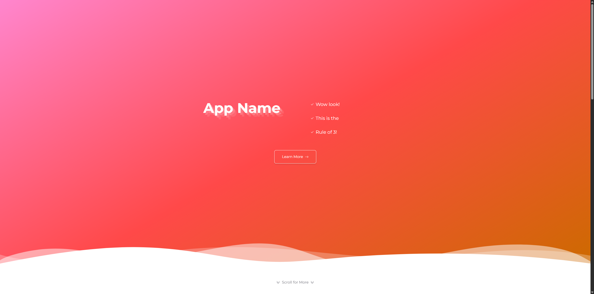

# Meet@ Mockup

React-based mockup for [meet-at-app](https://github.com/CitharaYote/meet-at-app).

This repository contains a front-end prototype built with Vite, React, TypeScript, Tailwind CSS, and Framer Motion. It is a visual mockup rather than a production implementation of the original project.

## Preview



## Project Structure

- `app/` - Vite React application source
- `images/` - project screenshots and other static assets

## Getting Started

From the `app/` directory:

```bash
npm install
npm run dev
```

## Available Scripts

From `app/`:

- `npm run dev` - start the local development server
- `npm run build` - type-check and build for production
- `npm run lint` - run ESLint
- `npm run preview` - preview the production build locally

## Notes

- The mockup is focused on layout, motion, and visual presentation.
- Content in the UI is placeholder text used to demonstrate the interface.
